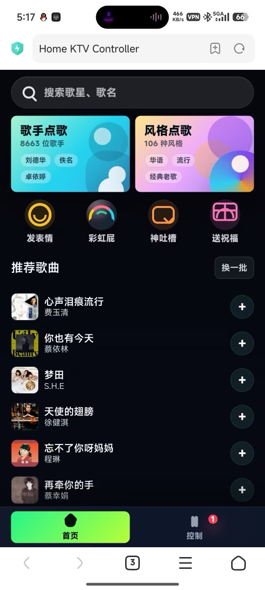
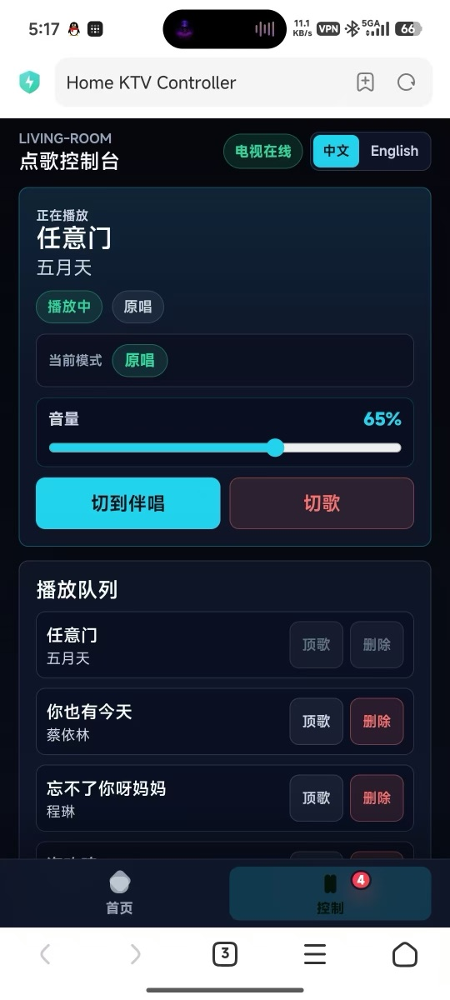

# HomeKTV System

> A self-hosted home karaoke system: Android TV playback, mobile song request, admin console, real NAS music library indexing, and one-command deployment.

<p>
  <a href="docs/deployment.md"></a>
  <a href="docs/KTV-ARCHITECTURE.md"></a>
  <a href="clients/android-tv/README.md"></a>
  <a href="package.json"></a>
</p>

HomeKTV 是一个面向家庭 KTV 场景的完整点歌系统。它把 NAS 里的真实 KTV MV 曲库接入数据库，电视端负责播放，手机扫码点歌，后台负责曲库和运行状态管理。

如果你有一批 KTV MV、家庭 NAS、电视盒子或 Android TV，这个项目可以帮你搭一套自己的家庭 KTV。

<p align="center">
  
</p>

<table>
  <tr>
    <td align="center" width="50%"></td>
    <td align="center" width="50%"></td>
  </tr>
</table>

## Features

- Android TV 正式播放端，使用 libVLC 播放真实 KTV MV。
- 手机扫码控制器，支持搜索、点歌、顶歌、切歌、原唱/伴唱切换和音量控制。
- Admin 后台，查看房间、队列、曲库、封面、标签、候选任务和系统诊断。
- 真实 NAS 曲库索引，支持批量扫描、技术探测、封面缓存和风格标签补全。
- 单文件双音轨模型，适配常见 KTV 原唱/伴唱资源。
- Web TV 调试端，方便本地开发和 UI 调试。
- 源码部署和 Docker Compose 部署两套入口，脚本内置 doctor、smoke、日志和状态检查。
- 热歌榜单、用户歌单、曲库热度评分等 Python/Node 工具，用于大曲库清理和整理。

## How It Works

<p align="center">
  
</p>

<p align="center">
  
</p>

## Quick Start

本项目是 monorepo，包含 API、Admin、Controller、Web TV、Android TV 和共享包。新手建议先用 Docker Compose 跑通服务，再安装 Android TV APK。

### 1. 准备环境

```text
Docker 部署: Git, Docker, Docker Compose
源码部署:   Git, Node.js, pnpm 10.x, PostgreSQL, ffmpeg / ffprobe
本地开发:   Node.js, pnpm 10.x, PostgreSQL, ffmpeg / ffprobe
Android TV: Android Platform Tools / adb
```

只想先体验 Web 和后台，可以先不装 Android 工具。没有真实曲库也能启动服务；要搜索和播放真实歌曲，需要把 NAS 曲库路径配置到 `.env`。真实电视播放需要 Android TV APK。

### 2. Docker Compose 一键启动

Docker 方式会启动 PostgreSQL、API、Admin、Controller 和 Web TV，适合第一次部署验证。

```bash
git clone https://github.com/ShaoLongFei/home-ktv-system.git
cd home-ktv-system

bash deploy/docker/ktv.sh setup
vim deploy/docker/.env
bash deploy/docker/ktv.sh start
bash deploy/docker/ktv.sh doctor
```

`.env` 里最重要的是把这些地址改成手机和电视都能访问的局域网 IP 或域名：

```bash
PUBLIC_BASE_URL=http://<server-ip>:4000
ADMIN_BASE_URL=http://<server-ip>:5174
CONTROLLER_BASE_URL=http://<server-ip>:5176
TV_WEB_BASE_URL=http://<server-ip>:5173
CORS_ALLOWED_ORIGINS=http://<server-ip>:5174,http://<server-ip>:5176,http://<server-ip>:5173
KTV_NAS_HOST_PATH=/mnt/nas/KTV歌曲
```

常用命令：

```bash
bash deploy/docker/ktv.sh status
bash deploy/docker/ktv.sh logs
bash deploy/docker/ktv.sh restart
bash deploy/docker/ktv.sh stop
```

完整说明见 [Docker Compose 部署](docs/deployment-docker.md)。

### 3. 源码一键部署

源码部署适合服务器已经安装 Node.js、pnpm 和 PostgreSQL 的场景。它不启动 PostgreSQL，但会自动拉代码、安装依赖、构建、迁移、重启、doctor 和 smoke。

```bash
git clone https://github.com/ShaoLongFei/home-ktv-system.git
cd home-ktv-system

bash deploy/source/ktv.sh setup
vim deploy/source/.env
bash deploy/source/ktv.sh deploy
bash deploy/source/ktv.sh status
```

常用命令：

```bash
bash deploy/source/ktv.sh deploy
bash deploy/source/ktv.sh logs api
bash deploy/source/ktv.sh doctor
bash deploy/source/ktv.sh smoke
bash deploy/source/ktv.sh restart
bash deploy/source/ktv.sh stop
```

完整说明见 [源码部署](docs/deployment-source.md)。

### 4. 本地开发

```bash
pnpm install
pnpm db:migrate
pnpm dev:local start
```

默认端口：

```text
API             http://127.0.0.1:4000
Web TV debug    http://127.0.0.1:5173
Admin           http://127.0.0.1:5174
Controller      http://127.0.0.1:5176
```

常用命令：

```bash
pnpm dev:local status
pnpm dev:local tail api
pnpm repo:hygiene
pnpm typecheck
pnpm test
pnpm build
```

本地开发说明见 [本地开发部署](docs/deployment-local.md)。

## Android TV

正式播放体验以 Android TV + libVLC 为准。Web TV 主要用于开发调试，浏览器对老 KTV 编码的兼容性不能代表真实电视端能力。

构建 APK：

```bash
cd clients/android-tv
./gradlew :app:testDebugUnitTest :app:assembleDebug --no-daemon
```

安装到电视：

```bash
adb connect <TV_IP>:5555
adb install -r app/build/outputs/apk/debug/app-debug.apk
```

连接本地或服务器 API：

```bash
adb shell am start -W \
  -n com.liuyue.homektv/.MainActivity \
  --es apiBaseUrl http://<server-ip>:4000 \
  --es room living-room \
  --es deviceName "Living Room TV"
```

更多说明见 [Android TV 文档](clients/android-tv/README.md)。

## Library Maintenance

真实曲库维护集中在 API 和 `scripts/tools`：

```bash
bash deploy/source/ktv.sh probe-index -- --limit 300 --concurrency 2
bash deploy/source/ktv.sh cover-status
bash deploy/source/ktv.sh fetch-covers -- --limit 300
bash deploy/source/ktv.sh cover-coverage -- --limit 100
python3 scripts/tools/run_style_tagging_llm_batch.py status --env-file deploy/source/.env --output runtime/tagging/llm/llm-style-tags.jsonl
```

热门歌曲和歌单热度工具：

```bash
pnpm hot-songs:update
```

详细流程见 [真实曲库索引](docs/KTV-FULL-INDEX.md)、[歌曲封面缓存](docs/runbooks/song-cover-fetching.md) 和 [工具脚本说明](scripts/tools/README.md)。

## Project Structure

```text
home-ktv-system/
├── apps/
│   ├── api/                 # 后端 API、房间状态、播放队列、媒体网关
│   ├── admin/               # KTV 后台管理界面
│   ├── controller/          # 手机扫码点歌控制器
│   └── tv-web/              # Web TV 调试端
├── clients/
│   └── android-tv/          # Android TV 正式播放端
├── packages/                # 共享领域模型、协议、会话引擎、热门歌曲工具
├── deploy/                  # Docker 和源码部署入口
├── scripts/                 # 本地开发、曲库维护和运维脚本
├── docs/                    # 架构、部署、曲库和运维文档
└── runtime/                 # 源码部署运行时目录，生成产物不入库
```

## Documentation

- [文档总入口](docs/README.md)
- [当前架构](docs/KTV-ARCHITECTURE.md)
- [部署说明](docs/deployment.md)
- [项目结构](docs/project-structure.md)
- [数据库结构](docs/database-schema.md)
- [真实曲库索引](docs/KTV-FULL-INDEX.md)
- [部署脚本入口](deploy/README.md)
- [Android TV](clients/android-tv/README.md)

## Product Boundaries

- Admin 暂不做登录鉴权，访问边界交给部署网络、反向代理和域名暴露范围。
- 公网媒体流暂不做 token 或签名 URL。
- Android TV 是正式播放端；Web TV 保留为开发调试端。
- 真实曲库走全自动索引和入库，Admin 用于查看、诊断和管理资源。
- Android TV APK 当前由本地手动打包后覆盖安装。

## Why HomeKTV

很多家庭 KTV 项目停留在播放器或歌单工具。HomeKTV 的目标是把真实家庭使用链路做完整：NAS 曲库、电视播放、手机点歌、后台管理、部署脚本和曲库维护工具都放在同一个仓库里。

如果这个项目对你有帮助，欢迎 star。它会继续朝着更稳定的家庭 KTV 自托管系统演进。
